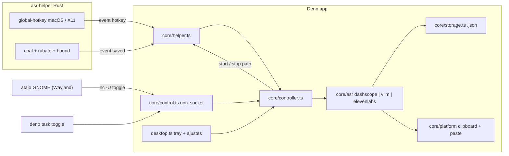

# Deno ASR

Dictado por voz con atajo global para macOS y Linux. Pulsas el atajo, hablas, lo vuelves a pulsar y
el texto transcrito (por **Qwen3-ASR** o **ElevenLabs Scribe**) se pega donde tengas el cursor. Cada
grabación se guarda como par `.wav` + `.json` para poder corregirla después y usarla como dataset de
entrenamiento.

- Backends, intercambiables en caliente desde la bandeja:
  - **DashScope** (API de Alibaba, `qwen3-asr-flash`).
  - **vLLM** local (`Qwen/Qwen3-ASR-*`).
  - **ElevenLabs** (`scribe_v2`).
- Idioma por defecto: español.
- App de bandeja (`deno desktop`) con ventana de ajustes, o modo headless.
- Grabación y atajo global en un helper nativo en Rust (`asr-helper`); todo lo demás en Deno.

## Índice

- [Arquitectura](#arquitectura)
- [Requisitos](#requisitos)
- [Uso rápido](#uso-rápido)
- [Tareas](#tareas)
- [Configuración](#configuración)
- [Motores ASR](#motores-asr)
- [Atajo global](#atajo-global)
- [Dataset](#dataset)
- [Salida del texto](#salida-del-texto)
- [Build y empaquetado](#build-y-empaquetado)
- [Tests](#tests)
- [Estructura del proyecto](#estructura-del-proyecto)
- [Troubleshooting](#troubleshooting)
- [Limitaciones conocidas](#limitaciones-conocidas)

## Arquitectura



**Reparto de responsabilidades**

| Pieza        | Hace                                                                                  |
| ------------ | ------------------------------------------------------------------------------------- |
| `asr-helper` | Abre el micro, remuestrea a 16 kHz mono PCM16, escribe el WAV y captura el atajo      |
| Deno         | Bandeja, ajustes, config, llamada al ASR, `.json`, portapapeles, pegado, avisos       |
| Unix socket  | Instancia única + control externo (`toggle`/`status`/`cancel`), usado por GNOME y CLI |

Deno lanza el helper como proceso hijo y habla con él por stdin/stdout con JSON por líneas. El
protocolo completo está en [helper/README.md](helper/README.md). Si el helper muere, Deno lo relanza
con backoff exponencial y vuelve a registrar el atajo. Si Deno muere, el helper detecta EOF en stdin
y termina (nunca se queda con el micro abierto).

**Flujo de una grabación**

1. Atajo / bandeja / socket → `Controller.toggle()`.
2. `idle → starting`: se manda `start` al helper. Cuando responde `recording` (el stream ya está
   sonando) → `recording` + sonido de inicio. Se programa auto-stop a `maxSeconds`.
3. Segunda pulsación → `transcribing`: Deno genera id y ruta (`storage.newSample`) y manda
   `stop {path}`. El helper escribe el WAV y responde `saved {duration_sec}`.
4. Si dura menos de `minSeconds`, se borra y se descarta.
5. Deno lee el WAV, lo manda al backend ASR, escribe el `.json` (atómico) y entrega el texto
   (pegar/escribir/portapapeles).
6. Si el ASR falla, **el WAV se conserva** y el `.json` queda con `status: "error"` para poder
   re-transcribirlo después.

Pulsaciones durante `starting` o `transcribing` se ignoran.

## Requisitos

- [Deno](https://deno.com) ≥ 2.9 (necesario para `deno desktop`, que es experimental).
- [Rust](https://rustup.rs) estable (edición 2024): `curl https://sh.rustup.rs -sSf | sh`.

### macOS

Nada más. Usa `pbcopy`, `osascript` y `afplay`, que vienen con el sistema.

Permisos que pedirá macOS:

- **Micrófono**: la primera vez que grabes. Se atribuye a la app que lanza el helper (DenoASR.app, o
  tu terminal en modo dev/headless).
- **Accesibilidad**: para el auto-pegado (`osascript` envía Cmd+V vía System Events). Sin él, el
  texto queda en el portapapeles y verás un aviso. El atajo global **no** necesita Accesibilidad
  (usa Carbon `RegisterEventHotKey`).

### Ubuntu / Linux

```bash
sudo apt install build-essential pkg-config libasound2-dev libx11-dev libxi-dev \
  wl-clipboard xclip ydotool xdotool zenity libnotify-bin netcat-openbsd
```

Qué se usa según sesión:

| Función          | Wayland (Ubuntu por defecto)        | X11          |
| ---------------- | ----------------------------------- | ------------ |
| Atajo global     | atajo personalizado de GNOME + `nc` | `asr-helper` |
| Portapapeles     | `wl-copy` / `wl-paste`              | `xclip`      |
| Pegar / escribir | `ydotool`                           | `xdotool`    |
| Sonidos          | `pw-play` o `paplay`                | ídem         |
| Selector carpeta | `zenity`                            | ídem         |
| Notificaciones   | `notify-send`                       | ídem         |

`ydotool` necesita la versión **1.x** (sintaxis `ydotool key 29:1 47:1 …`), el daemon `ydotoold`
corriendo y acceso a `/dev/uinput`. Ubuntu 24.04+ trae 1.x; Ubuntu 22.04 trae 0.1.x, que no es
compatible (compila 1.x desde [ReimuNotMoe/ydotool](https://github.com/ReimuNotMoe/ydotool)).

```bash
sudo usermod -aG input $USER   # re-login después
ydotoold &                     # o como servicio de usuario de systemd
```

## Uso rápido

```bash
export DASHSCOPE_API_KEY=sk-...   # o ponlo en config.json

deno task dev      # app de bandeja (compila el helper en debug)
deno task start    # headless, mismo core sin GUI
```

Atajo por defecto: **⇧⌘Espacio** en macOS, **Ctrl+Shift+Espacio** en Linux.

Con vLLM local:

```bash
vllm serve Qwen/Qwen3-ASR-1.7B        # expone /v1/audio/transcriptions en :8000
ASR_BACKEND=vllm deno task dev
```

Con ElevenLabs:

```bash
export ELEVENLABS_API_KEY=...
ASR_BACKEND=elevenlabs deno task dev   # o elígelo luego en la bandeja: Motor → ElevenLabs Scribe
```

Control desde terminal (con la app o el headless en marcha):

```bash
deno task toggle   # empieza / para
deno task status   # idle | starting | recording | transcribing
deno task cancel   # descarta la grabación en curso
```

## Tareas

| Tarea                    | Qué hace                                                       |
| ------------------------ | -------------------------------------------------------------- |
| `deno task dev`          | Compila el helper (debug) y lanza `deno desktop --hmr`         |
| `deno task start`        | Compila el helper (debug) y lanza el modo headless             |
| `deno task toggle`       | `toggle` por el socket de control                              |
| `deno task status`       | Estado actual por el socket                                    |
| `deno task cancel`       | Cancela la grabación en curso                                  |
| `deno task helper:build` | `cargo build --release` del helper                             |
| `deno task build:mac`    | Genera `dist/DenoASR.app` con el helper dentro, firmado ad-hoc |
| `deno task build:linux`  | Genera `dist/deno-asr/` con el helper junto al binario         |
| `deno task test`         | Tests de Deno + `cargo test`                                   |
| `deno task check`        | `deno check` + `deno lint` + `deno fmt --check`                |

## Configuración

Fichero `config.json`:

- macOS: `~/Library/Application Support/deno-asr/config.json`
- Linux: `${XDG_CONFIG_HOME:-~/.config}/deno-asr/config.json`

Se crea con todos los valores por defecto en el primer arranque (permisos `0600`).

**Desde la app** (bandeja → _Ajustes…_) se edita y se aplica al guardar, sin reiniciar:

- Atajo y directorio del dataset.
- Motor (`asrBackend`, también desde el submenú _Motor_ de la bandeja), idioma y modo de salida.
- API keys de DashScope, ElevenLabs y vLLM, y URL y modelo de vLLM. Solo se ven los campos del motor
  seleccionado.

Las API keys nunca se envían completas a la ventana: solo ves si hay una guardada y sus 4 últimos
caracteres. Déjala vacía para conservarla, escribe una nueva para reemplazarla o pulsa _Quitar_ para
borrarla. Si un valor viene de una variable de entorno, su campo aparece deshabilitado e indica qué
variable manda.

El resto (`restoreClipboard`, `pasteKeys`, `sounds`, `maxSeconds`…) se edita a mano en el fichero
(hay que reiniciar la app) o por variables de entorno.

**Precedencia:** defaults ← `config.json` ← variables de entorno. Las variables de entorno **nunca**
se escriben a disco, así que puedes tener la API key solo en el entorno.

| Clave                       | Default                                                  | Env                  | Descripción                                                        |
| --------------------------- | -------------------------------------------------------- | -------------------- | ------------------------------------------------------------------ |
| `hotkey`                    | `CmdOrCtrl+Shift+Space`                                  | `HOTKEY`             | Ver [formato](#formato-del-atajo)                                  |
| `datasetDir`                | `~/deno-asr-dataset`                                     | `DATASET_DIR`        | Dónde se guardan `.wav` + `.json`                                  |
| `language`                  | `es`                                                     | `ASR_LANGUAGE`       | Código de idioma que se pasa al ASR                                |
| `asrBackend`                | `dashscope`                                              | `ASR_BACKEND`        | `dashscope` \| `vllm` \| `elevenlabs`                              |
| `dashscope.apiKey`          | `""`                                                     | `DASHSCOPE_API_KEY`  | API key de Model Studio                                            |
| `dashscope.baseUrl`         | `https://dashscope-intl.aliyuncs.com/compatible-mode/v1` | `DASHSCOPE_BASE_URL` | Para China: `https://dashscope.aliyuncs.com/compatible-mode/v1`    |
| `dashscope.model`           | `qwen3-asr-flash`                                        | `DASHSCOPE_MODEL`    |                                                                    |
| `vllm.baseUrl`              | `http://localhost:8000/v1`                               | `VLLM_BASE_URL`      |                                                                    |
| `vllm.model`                | `Qwen/Qwen3-ASR-1.7B`                                    | `VLLM_MODEL`         | Nombre con el que se sirvió el modelo                              |
| `vllm.apiKey`               | `""`                                                     | `VLLM_API_KEY`       | Solo si lanzaste vLLM con `--api-key`                              |
| `elevenlabs.apiKey`         | `""`                                                     | `ELEVENLABS_API_KEY` | API key de ElevenLabs (cabecera `xi-api-key`)                      |
| `elevenlabs.baseUrl`        | `https://api.elevenlabs.io`                              |                      |                                                                    |
| `elevenlabs.model`          | `scribe_v2`                                              | `ELEVENLABS_MODEL`   |                                                                    |
| `elevenlabs.tagAudioEvents` | `false`                                                  |                      | Si es `true`, Scribe añade etiquetas como `(risas)` al texto       |
| `mic`                       | `null`                                                   | `MIC`                | Nombre exacto del dispositivo; `null` = entrada por defecto        |
| `outputMode`                | `paste`                                                  | `OUTPUT_MODE`        | `paste` \| `type` \| `clipboard` (ver [salida](#salida-del-texto)) |
| `restoreClipboard`          | `true`                                                   |                      | En modo `paste`, restaura el portapapeles anterior a los 400 ms    |
| `pasteKeys`                 | `ctrl+v`                                                 |                      | Solo Linux. `ctrl+shift+v` para terminales                         |
| `sounds`                    | `true`                                                   |                      | Sonidos de inicio / fin / error                                    |
| `notifications`             | `true`                                                   |                      | Avisos del sistema en errores y en modo `clipboard`                |
| `maxSeconds`                | `300`                                                    |                      | Auto-stop. DashScope acepta hasta 10 MB (≈ 5 min a 16 kHz PCM16)   |
| `minSeconds`                | `0.3`                                                    |                      | Grabaciones más cortas se descartan                                |

Otras variables:

| Variable          | Uso                                                                           |
| ----------------- | ----------------------------------------------------------------------------- |
| `ASR_HELPER_PATH` | Ruta al binario del helper. Si no está, `dirname(Deno.execPath())/asr-helper` |

## Motores ASR

| `asrBackend` | Servicio                   | Endpoint                                          | Auth                    |
| ------------ | -------------------------- | ------------------------------------------------- | ----------------------- |
| `dashscope`  | Qwen3-ASR en Model Studio  | `POST {baseUrl}/chat/completions` (`input_audio`) | `Authorization: Bearer` |
| `vllm`       | Qwen3-ASR servido en local | `POST {baseUrl}/audio/transcriptions` (multipart) | Bearer opcional         |
| `elevenlabs` | ElevenLabs Scribe          | `POST {baseUrl}/v1/speech-to-text` (multipart)    | `xi-api-key`            |

**Cambiar de motor:** en la bandeja, _Motor → …_ (el activo lleva ✓), o en _Ajustes…_ junto con su
API key. La elección se guarda en `config.json` y se aplica a la **siguiente** grabación, sin
reiniciar: el backend se crea de nuevo en cada transcripción. En headless, usa `ASR_BACKEND` o edita
`asrBackend` en el fichero. Si `ASR_BACKEND` está definida, manda sobre lo que elijas en la bandeja.

Cada `.json` guarda `backend` y `model`, así que puedes mezclar motores en el mismo dataset y
filtrar después.

`language` se pasa tal cual a los tres (`es`; ElevenLabs acepta ISO-639-1 o ISO-639-3). En
ElevenLabs, `tagAudioEvents` está desactivado por defecto para que el texto de referencia del
dataset no lleve etiquetas como `(risas)` o `(música)`.

Para añadir otro motor, implementa `AsrBackend` ([src/core/asr/types.ts](src/core/asr/types.ts)),
añádelo a `ASR_BACKENDS` y a `Config` en [src/core/config.ts](src/core/config.ts), y crea su `case`
en [src/core/asr/mod.ts](src/core/asr/mod.ts) y su etiqueta en `BACKEND_LABEL` en
[src/desktop.ts](src/desktop.ts).

## Atajo global

Hay tres modos, que se eligen solos al arrancar (se muestran en los ajustes y en el log):

| Modo     | Cuándo                              | Cómo                                                                            |
| -------- | ----------------------------------- | ------------------------------------------------------------------------------- |
| `native` | macOS, Linux X11                    | `asr-helper` registra el atajo con `global-hotkey` y emite `{"event":"hotkey"}` |
| `gnome`  | Linux Wayland + GNOME + `gsettings` | Custom keybinding de GNOME que ejecuta `printf toggle \| nc -U -N <socket>`     |
| `none`   | Wayland sin GNOME (KDE, Sway…)      | Sin atajo global. Usa la bandeja o asigna `deno task toggle` en tu compositor   |

En modo `gnome` la entrada queda en
`/org/gnome/settings-daemon/plugins/media-keys/custom-keybindings/deno-asr/` y es visible en
_Configuración → Teclado → Atajos personalizados_ como "Deno ASR".

En modo `none` puedes enlazar a mano en tu compositor, p. ej. en Sway:

```
bindsym Ctrl+Shift+space exec sh -c 'printf toggle | nc -U -N $XDG_RUNTIME_DIR/deno-asr.sock'
```

### Formato del atajo

El de `global-hotkey`: modificadores + un
[`KeyboardEvent.code`](https://developer.mozilla.org/docs/Web/API/UI_Events/Keyboard_event_code_values)
del W3C, separados por `+`.

- Modificadores: `CmdOrCtrl` (⌘ en macOS, Ctrl en Linux), `Super`, `Ctrl`, `Alt`, `Shift`.
- Teclas: `KeyA`…`KeyZ`, `Digit0`…`Digit9`, `F1`…`F24`, `Space`, `Enter`, `Tab`, `Escape`,
  `Backspace`, flechas, `Backquote`, `Minus`, `Equal`, corchetes, etc. La lista exacta es
  `SUPPORTED_CODES` en [src/hotkey/combo.ts](src/hotkey/combo.ts).
- Hace falta al menos un modificador. En la UI, Shift solo no cuenta.

Ejemplos: `CmdOrCtrl+Shift+Space`, `Ctrl+Alt+KeyD`, `Super+F9`.

En la ventana de ajustes pulsa el botón del atajo y teclea la combinación (Esc cancela). Mientras
grabas la combinación, el atajo actual se pausa para que no dispare una grabación. Al guardar se
registra el nuevo atajo; si falla (p. ej. otra app ya lo tiene), se mantiene el anterior y ves el
error.

## Dataset

```
~/deno-asr-dataset/
└── 2026-09-23/
    ├── 20260923-013600-a1b2.wav
    └── 20260923-013600-a1b2.json
```

- Una carpeta por día (hora local). Id = `YYYYMMDD-HHmmss-xxxx` (4 hex aleatorios).
- **WAV**: 16 kHz, mono, PCM 16-bit. Se captura al rate nativo del micro, se hace downmix a mono en
  el callback y se remuestrea con FFT (`rubato`) al parar.
- **JSON**: se escribe de forma atómica (`.tmp` + `rename`).

```json
{
  "id": "20260923-013600-a1b2",
  "audio": "20260923-013600-a1b2.wav",
  "text": "transcripción original del modelo",
  "text_corrected": null,
  "reviewed": false,
  "language": "es",
  "backend": "dashscope",
  "model": "qwen3-asr-flash",
  "duration_sec": 4.21,
  "sample_rate": 16000,
  "created_at": "2026-09-23T01:36:00+02:00",
  "platform": "macos",
  "status": "ok"
}
```

| Campo            | Significado                                                               |
| ---------------- | ------------------------------------------------------------------------- |
| `audio`          | Nombre del WAV, relativo al propio `.json`                                |
| `text`           | Salida literal del modelo (ITN desactivado en DashScope). `null` si falló |
| `text_corrected` | Para tu corrección manual. `null` = sin corregir                          |
| `reviewed`       | Márcalo a `true` cuando lo hayas revisado                                 |
| `backend`        | `dashscope` \| `vllm` \| `elevenlabs`                                     |
| `model`          | Modelo usado (`qwen3-asr-flash`, `Qwen/Qwen3-ASR-1.7B`, `scribe_v2`…)     |
| `status`         | `ok` \| `error`. Con `error` hay además un campo `error` con el mensaje   |

Para entrenar, el texto de referencia es `text_corrected ?? text`. Ejemplo de export a JSONL con
`jq`:

```bash
find ~/deno-asr-dataset -name '*.json' -print0 \
  | xargs -0 jq -c 'select(.status=="ok") | {audio: (input_filename | sub("\\.json$"; ".wav")), text: (.text_corrected // .text)}'
```

Si cambias `datasetDir`, las muestras nuevas van al directorio nuevo; las antiguas no se mueven.

## Salida del texto

| `outputMode` | Comportamiento                                                                                |
| ------------ | --------------------------------------------------------------------------------------------- |
| `paste`      | Copia al portapapeles, envía Cmd+V / Ctrl+V y, si `restoreClipboard`, restaura el anterior    |
| `type`       | Teclea el texto carácter a carácter (`osascript keystroke` / `ydotool type` / `xdotool type`) |
| `clipboard`  | Solo copia y muestra un aviso con el texto                                                    |

Si pegar o teclear falla (sin permiso de Accesibilidad, sin `ydotoold`…), el texto se queda en el
portapapeles y aparece un aviso con el motivo.

## Build y empaquetado

### macOS

```bash
deno task build:mac
open dist/DenoASR.app
```

[scripts/build.ts](scripts/build.ts) hace:

1. `cargo build --release` del helper.
2. `deno desktop -A --include ui/ -o dist/DenoASR src/desktop.ts` (añade `.app` solo).
3. Copia `asr-helper` a `Contents/MacOS/` (la app lo busca en `dirname(Deno.execPath())`).
4. `PlistBuddy`: `NSMicrophoneUsageDescription` en español, `CFBundleName = "Deno ASR"` y
   `LSUIElement = true` (sin icono en el Dock).
5. `codesign --force --deep --sign -` y `codesign --verify --deep --strict`.

La firma es ad-hoc: sirve en tu máquina. Para distribuirla hace falta un Developer ID y
notarización. Si re-firmas o recompilas, macOS puede volver a pedir los permisos de micro y
Accesibilidad.

### Linux

```bash
deno task build:linux
```

Genera la salida de `deno desktop` en `dist/deno-asr/` y copia `asr-helper` junto al runtime
(`libruntime.so` / `laufey_webview`) y en la raíz de `dist/deno-asr/`.

### Autostart (manual)

- macOS: _Ajustes del Sistema → General → Ítems de inicio_ → añade `DenoASR.app`.
- GNOME: crea `~/.config/autostart/deno-asr.desktop` con `Exec=/ruta/al/binario`.

## Tests

```bash
deno task test
```

- **Deno** (`src/**/*_test.ts`): conversión de atajos, arrays de `gsettings`, storage, config
  (merge, env no persistida, `0600`), backends DashScope, vLLM y ElevenLabs con `fetch` mockeado,
  socket de control (comandos, instancia única) y cliente del helper contra un helper falso
  ([src/core/testdata/fake_helper.ts](src/core/testdata/fake_helper.ts)): request/response, eventos
  espontáneos, timeouts y reinicio tras crash.
- **Rust** (`cargo test`): parseo/serialización del protocolo, remuestreo, clamping a i16, WAV
  válido y parseo de atajos.

No hay test automático del micro real ni de la GUI.

## Estructura del proyecto

```
deno.json                 tareas, imports, config de deno desktop
scripts/build.ts          build:mac / build:linux
helper/                   asr-helper (Rust), ver helper/README.md
  src/main.rs             event loop (tao en macOS) + despacho de comandos
  src/protocol.rs         tipos del protocolo JSON-lines
  src/recorder.rs         cpal → downmix → rubato 16 kHz → hound WAV
  src/hotkey.rs           global-hotkey (macOS / X11)
src/
  desktop.ts              entrypoint deno desktop: bandeja, ventana de ajustes, bindings
  headless.ts             entrypoint sin GUI
  cli.ts                  cliente del socket (toggle / status / cancel)
  app.ts                  ensambla config + helper + controller + socket + modo de atajo
  core/
    helper.ts             cliente del helper: spawn, request/response por id, reinicio
    controller.ts         máquina de estados de grabación → ASR → dataset → salida
    config.ts             ConfigStore (defaults ← fichero ← env)
    control.ts            unix socket de control e instancia única
    settings.ts           validación de la ventana de ajustes y vista con keys enmascaradas
    storage.ts            ids, rutas y escritura atómica del .json
    asr/                  AsrBackend: dashscope.ts, vllm.ts, elevenlabs.ts
    platform/             portapapeles, pegado, sonidos, avisos, selector (darwin / linux)
  hotkey/
    combo.ts              parseo / normalización / formato GNOME / etiqueta legible
    gnome.ts              registro del atajo en GNOME vía gsettings
  desktop/
    api.ts                tipos mínimos de las APIs de deno desktop
    icons.ts              iconos de bandeja generados en runtime (PNG)
ui/                       ventana de ajustes (HTML/CSS/JS en el webview)
```

Socket de control: macOS `~/Library/Caches/deno-asr.sock`, Linux `$XDG_RUNTIME_DIR/deno-asr.sock`.
Protocolo: una línea (`toggle` | `status` | `cancel`) y una línea de respuesta (`ok` o el estado).

## Troubleshooting

| Síntoma                                        | Causa / solución                                                                                                   |
| ---------------------------------------------- | ------------------------------------------------------------------------------------------------------------------ |
| `asr-helper not found at …`                    | En dev usa `deno task dev` (define `ASR_HELPER_PATH`). En build, el helper debe estar junto al ejecutable          |
| `another deno-asr instance is running`         | Ya hay una instancia respondiendo en el socket (`deno task status`). Un `.sock` huérfano se borra solo al arrancar |
| Graba silencio en macOS                        | Permiso de micro denegado: _Ajustes → Privacidad y seguridad → Micrófono_. Revisa también `mic` en la config       |
| No pega, pero el texto está en el portapapeles | macOS: falta Accesibilidad. Wayland: `ydotoold` no está corriendo o no tienes acceso a `/dev/uinput`               |
| En terminales Linux no pega                    | Pon `"pasteKeys": "ctrl+shift+v"`                                                                                  |
| `DashScope API key missing`                    | Define `DASHSCOPE_API_KEY` o `dashscope.apiKey`                                                                    |
| `HTTP 401` de DashScope                        | Key de la región equivocada: la key internacional va con `dashscope-intl`, la de China con `dashscope`             |
| `ElevenLabs API key missing` / `HTTP 401`      | Define `ELEVENLABS_API_KEY` o `elevenlabs.apiKey`, y comprueba que la key tiene permiso de Speech to Text          |
| Cambio de motor en la bandeja sin efecto       | `ASR_BACKEND` está definida en el entorno y tiene prioridad sobre `config.json`                                    |
| `audio is X MB; … up to 10 MB`                 | Grabación demasiado larga para DashScope. Baja `maxSeconds` o usa vLLM                                             |
| El atajo no hace nada en Wayland               | Comprueba que `nc` es `netcat-openbsd` (`-U -N`) y que la entrada aparece en los atajos personalizados de GNOME    |
| `hotkey … already registered`                  | Otra app tiene esa combinación. Elige otra                                                                         |

Los logs salen por stderr: `[deno-asr]` para la app y `[asr-helper]` para el helper. En la app
empaquetada de macOS: `/Applications/DenoASR.app/Contents/MacOS/laufey_webview` desde terminal.

## Limitaciones conocidas

- `deno desktop` es experimental; su API puede cambiar entre versiones de Deno.
- Wayland fuera de GNOME no tiene atajo global automático.
- Sin UI de revisión/corrección del dataset (hay que editar los `.json`).
- Las opciones avanzadas (`restoreClipboard`, `pasteKeys`, `sounds`, `notifications`, `maxSeconds`,
  URLs de DashScope/ElevenLabs, `tagAudioEvents`) solo se cambian en `config.json`.
- Sin autostart integrado.
- `build:linux` no está verificado en Ubuntu real; la estructura de salida de `deno desktop` en
  Linux puede requerir ajustar dónde se copia el helper.
- No se ha probado el portal `GlobalShortcuts` de GNOME 48+, que permitiría un atajo nativo en
  Wayland.
